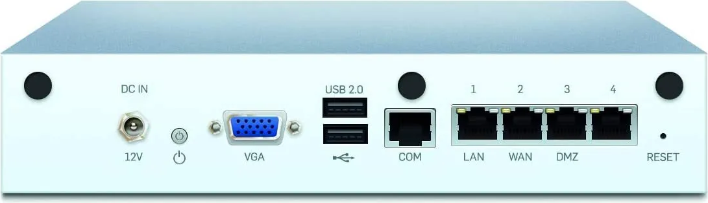

# Installing pfSense on a Sophos XG 115
## Console Cable Notes
The Sophos XG 115 has a VGA port and a Console port:  
This method uses a console cable to connect to the firewall.  [The cable I used](https://www.amazon.com/gp/product/B08T16TCN5/ref=ppx_yo_dt_b_search_asin_title?ie=UTF8&psc=1) is available on Amazon, and it has not caused me any problems since I started using it months ago. 

## Write the pfSense Image to the USB Drive
+ Download [Rufus](https://rufus.ie/en/)
+ Download the [pfSense memstick image](https://www.pfsense.org/download/)
+ Install and run Rufus
+ Write the pfSense memstick image to the USB drive using Rufus

## Locate the COM Port in Windows
+ Press the Windows key and type "Device Manager", press enter
+ Scroll down to Ports (COM&LPT)
+ Look for "USB-SERIAL CH340", take note of the COM port
+ 

## Connect to the Sophos XG 115 Using PuTTy
+ Note: The BIOS procedure outlined here was able to successfully enable me to install pfSense.  The information I got my settings from came from [this](https://www.reddit.com/r/PFSENSE/comments/uyjkgv/anyone_running_pfsense_on_a_sophos_xg115_rev_2/) post on Reddit.  I cannot speak for any other settings listed in the document, as what I outline here is what worked for me.
+ Download [PuTTY](https://www.puttygen.com/download-putty)
+ Install and Run PuTTy
+ Set "Serial Line" to the COM port that was noted 
+ 
+ In the left hand menu, go to Connection -> Serial
+ Set the following options:
+ Serial Line to Connect To: COM Port that was Noted
+ Speed: 38400
+ Data Bits: 8
+ Stop Bits: 1
+ Click "Open"

## Change the BIOS Settings in the Sophos XG 115
+ Press F2 like a madman to get to the bios screen
+ 
+ Go to Advanced -> USB Configuration
+ Make sure "Port 60/64 Emulation" is set to "Disabled"
+ Go to Boot
+ Go to Boot Option #1
+ Select USB Hard Disk
+ Go to Save & Exit
+ Select "Save Changes & Reset" and press enter
+ Very quickly, manually power the firewall off by holding the power key for 5 seconds (the light will turn red) -- don't power the firewall back up until the settings for putty are tweaked)

## Tweak PuTTy Settings for pfSense
+ Open putty back up
+ Change "Speed" to 115200
+ Click "Open"

## Connect to pfSense
+ Power the firewall back on
+ You'll soon end up at the pfSense boot screen
+ Wait for pfSense to show "vt100" and select that
+ Press enter to select "Accept" the license agreement
+ Press enter to select "Install pfSense"
+ Press enter to select "Guided Root-on-ZFS"
+ Press enter to use default ZFS pool name
+ Press enter to "Proceed with Installation"
+ Press enter to select "Stripe - No Redundancy"
+ Press the spacebar and then press enter to pick "ZFS Configuration" displayed
+ Press enter to select "Yes"
+ After pfSense extracts the files and reboots, remove the USB drive

## pfSense Configuration
+ You will end up at the pfSense boot screen again
+ Let pfSense run its course until you come to the configuration screen

### ASSIGN INTERFACES
+ Press '1' to "Assign Interfaces"
+ Press 'n' for "Should VLANs be set up now"
+ Enter the name of your WAN interface (should be igb1 as that is the interface labeled WAN on the back of the Sophos XG 115)
+ Enter the name of your LAN interface (should be igb0 as that is the interface labeled LAN on the back of the Sophos XG 115)
+ Press enter to skip "Enter the Optional 1 interface name"
+ Press 'y' for "Do you want to proceed?"
+ pfSense will then write the configuration and reload the settings

### SET UP THE LAN INTERFACE 
+ Press 'n' for "Configure IPv4 address"
+ Enter 192.168.200.1 for the LAN IP address
+ Enter 24 for the subnet bit count
+ Press enter to skip IPv6 addressing
+ Press 'y' to enable the DHCP server
+ Enter 192.168.200.2 for the start address of the range
+ Enter 192.168.200.254 for the ending address of the range
+ Enter 'n' to use HTTPS for the webConfigurator protocol
+ pfSense will write the changes and reload configurations
+ pfSense will tell you the webConfigurator is ready to go

### CONTINUING CONFIGURATION VIA THE WEBCONFIGURATOR
+ Open up a web browser and go to 192.168.200.1
+ Enter the default credentials -- username: admin, password: pfSense
+ You will end up at the pfSense initial configuration page
+ Click "next"
+ Click "next" at "Netgate Global Support"
+ Keep defaults for "General Information" and click "next"
+ Keep defaults for "Time Server Information" and click "next"
+ Keep defaults for "Configure WAN Interface" and click "next"
+ Keep defaults for "Configure LAN Interface" and click "next"
+ Change the password if you wish and click "next"
+ Click "reload"
+ From this point you should be able to connect to the Internet
  
